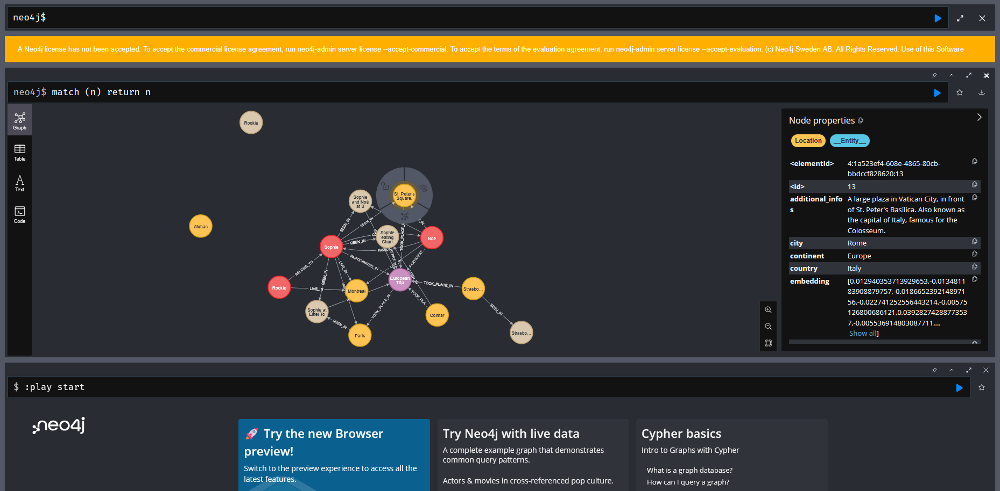

# LLM_agent

This agent is the central component that handles interactions between the client, the database, and the language models.

## Usage

To launch the agent, use one of these commands:

- **Development Mode:**  
    Run `python api.py`
    
- **Production Mode:**  
    Run `python -m waitress --listen=0.0.0.0:5124 api:app`

## Neo4j Console

## Requirements

Before running the agent, make sure you have:

- Neo4j Desktop installed with an empty database.
- An "images" folder in the repository root for storing images.
- A `.env` file containing:
    - `NEO4J_URI`: The connection URI for your Neo4j database, also used to access in browser the neo4j interface.
    - `NEO4J_USERNAME`: The username for the Neo4j database (commonly "neo4j").
    - `NEO4J_PASSWORD`: The password for the Neo4j database.
    - `OPENAI_API_KEY`: Your OpenAI API key for node embeddings.
    - `GOOGLE_API_KEY`: The API key for Gemini used by the agents.
    - `DEFAULT_AI_GEMINI_MODEL`: The Gemini model to be used.

## Agents Overview

The system includes three agents:

1. **AnswerAgent (ReAct):**
     - Responds quickly to user queries (approx. 5-10 seconds).
     - Uses the prompt template `USER_ANSWER.md`.

2. **UpdateAgent (ReAct):**
     - Updates the knowledge graph with user inputs.
     - Runs concurrently with the main process.
     - Uses the prompt template `ENTITIES_RELATIONS_GENERATION.md`.

3. **OptimizerAgent (non-ReAct):**
     - Checks for and merges duplicate entities or relationships.
     - Uses the prompt template `GRAPH_OPTIMIZATION.md`.

## Graph Backup & Restoration

Managed by `backup.py`, the backup system requires a folder named "backup" in the root directory. It works as follows:

- **Backup:**  
    Saves images and versions of the database to a timestamped folder.
    
- **Restore:**  
    Reverts the database and images folder to a selected backup version based on the timestamp.

Both functions stop and restarts the neo4j console database.